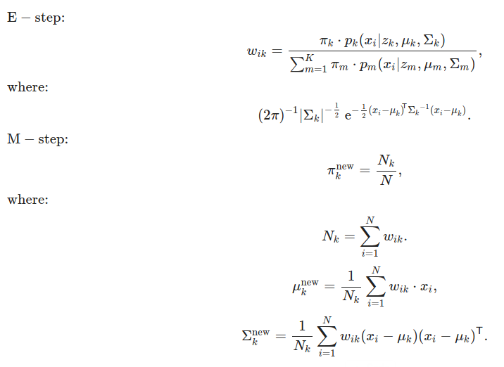

# Expectation-Maximization Algorithm

This repository implements the **Expectation-Maximization (EM) algorithm** for Gaussian Mixture Models (GMM). The EM algorithm is used to find maximum likelihood estimates of parameters in probabilistic models when the data contains latent variables.

## Table of Contents

- [Overview](#overview)
- [Features](#features)
- [Installation](#installation)
- [Performance Optimization](#performance)
- [Usage](#usage)
  - [1. Data Preparation](#data-preparation)
  - [2. Running the EM Algorithm](#running-the-em-algorithm)
- [Code Structure](#code-structure)
- [License](#license)

---

## Overview

The **Expectation-Maximization** algorithm is a general iterative method for finding maximum likelihood estimates in models where some of the data is missing or hidden. In this implementation, the EM algorithm is applied to **Gaussian Mixture Models (GMMs)**, a probabilistic model that assumes that the data is generated from a mixture of several Gaussian distributions with unknown parameters.

### Key Concepts:

- **Expectation (E-step)**: Compute the probability that each data point belongs to each Gaussian component based on the current parameters.
- **Maximization (M-step)**: Update the model parameters (means, covariances, and mixing coefficients) based on these probabilities.

The EM algorithm alternates between these two steps until convergence.



---

## Features

- **Customizable number of components**: Specify how many Gaussian distributions to fit to the data.
- **Log-likelihood tracking**: Monitor the progress of the EM algorithm by observing the log-likelihood values.
- **Covariance regularization**: Handles numerical stability by regularizing covariance matrices.
- **Stopping criteria**: Supports both log-likelihood convergence and maximum iterations as stopping conditions.

---

## Installation

1. Clone the repository to your local machine:

   ```bash
   git clone https://github.com/huytrnq/ExpectationMaximization.git
   ```

2. Navigate to the directory:

   ```bash
   cd ExpectationMaximization
   ```

3. Install the necessary dependencies. You can use `pip` or any other package manager of your choice:

   ```bash
   pip install -r requirements.txt
   ```

---

## Performance Optimization

|      Methodology    | For Loop        | Matrix Multiplication |
|---------------------|-----------------|-----------------------|
| Processing Time (s) | ~17.5           | ~0.1                  |

---

## Usage

### 1. Data Preparation

You need a dataset with `N` data points and `d` dimensions. The data should be stored in a NumPy array `X` of shape `(N, d)`.
In this example, I have 2 MRI images of the brain, and I want to segment them into 3 regions: white matter, gray matter, and cerebrospinal fluid. The two modalities are T1-weighted and T2-weighted images corresponding to d = 2 dimensions.

### 2. Running the EM Algorithm

You can run the EM algorithm by calling the main function in your code. Here’s an example:

```python
em = ExpectationMaximization(X, k=3, max_iter=50, type='kmeans', plot_step=25, save_path='results/', show_plot=True, stop_criterion=1e-4)
alphas, mus, covars, W = em.fit()
```

### Parameters:

- `X`: A NumPy array containing the dataset with shape `(N, d)`.
- `k`: Number of Gaussian components (clusters) corresponding to the number of regions you want to segment the data into.
- `max_iter`: Maximum number of iterations for the EM algorithm.
- `type`: Initialization method for the means and covariances. Options are `'random'` or `'kmeans'`.
- `plot_step`: Interval for plotting the segmentation results.
- `save_path`: Directory to save the results and plots.
- `show_plot`: Whether to display the segmentation results during training.
- `stop_criterion`: Stopping criterion for the EM algorithm based on the change in log-likelihood.

---

## Code Structure

```bash
.
├── data                    # Example data for testing
├── results                 # Output results (segmentation masks)
├── .gitignore              # Files to ignore in Git
├── README.md               # Project documentation
├── Exp.ipynb               # Jupyter notebook for Multi-Modal MRI Segmentation
├── Exp_Single.ipynb        # Jupyter notebook for Single-Modal MRI Segmentation
├── em_algo.py              # Main EM algorithm implementation
├── main.py                 # Script to run the EM algorithm on example datasets
├── requirements.txt        # Dependencies
└── utils.py                # Utility functions for dice score and visualization
```

---

## License

This project is licensed under the MIT License - see the [LICENSE](LICENSE) file for details.